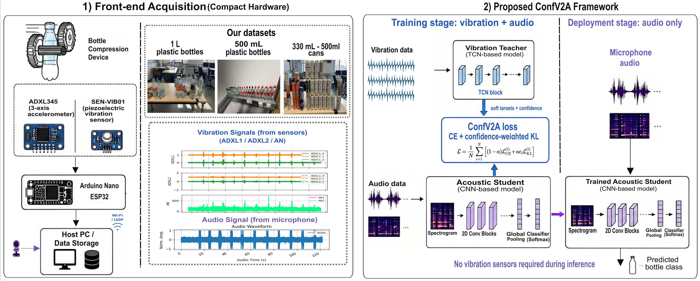

# ConfV2A Dataset and Code

**Confidence-Guided Vibration-to-Acoustic Distillation for Bottle Classification in Recycling**

ConfV2A trains an audio-only bottle classifier with help from synchronized vibration signals. A vibration teacher is used during training, but deployment only needs microphone audio.



## Highlights

- **Audio-only deployment:** no vibration sensors are required at inference time.
- **Vibration-guided training:** a TCN vibration teacher supervises a CNN acoustic student.
- **Confidence-aware distillation:** uncertain teacher predictions contribute less to the KL distillation term.
- **Real compactor data:** synchronized audio and vibration were collected during bottle/can compression events.
- **Reproducible outputs:** trained models, reports, confusion matrices, alpha sweeps, and noise robustness results are included.

## How To Read This Repository

If you are visiting this project for the first time, follow this order:

1. **Understand the idea:** start with the overview figure above.
2. **Inspect the data collection setup:** see [Dataset Overview](#dataset-Overview).
3. **Read the model pipeline:** see [Method](#method).
4. **Run the core scripts:** follow [Quick Start](#quick-start).
5. **Check outputs and comparisons:** see [Results](#results) and [Repository Map](#repository-map).

## Key Result

On the self-collected bottle/can compaction dataset, ConfV2A improves the audio-only baseline from **79.01%** to **90.24%** test accuracy while still using only audio at inference.

| Method | Inference input | Accuracy | Macro-F1 |
| --- | --- | ---: | ---: |
| Audio-only baseline | Audio | 79.01% | 78.19% |
| Vibration teacher | Vibration | 91.14% | 91.80% |
| Standard KD audio student | Audio | 86.99% | 86.62% |
| **ConfV2A audio student** | **Audio** | **90.24%** | **89.83%** |

## Dataset Overview

The self-collected dataset contains synchronized microphone audio and vibration recordings from a bottle-recycling compactor. Audio and vibration windows are temporally aligned so that the vibration teacher can supervise the acoustic student during training.

<p align="center">
  
  
</p>

| Item | Description |
| --- | --- |
| Task | Bottle/can classification in a recycling compactor |
| Modalities | Microphone audio + vibration sensors |
| Classes | 1 L bottle, 500 mL bottle, 330 mL can, 500 mL can, error |
| Events / windows | 120 detected events / 1206 retained windows |
| Window length | 0.8 s aligned audio-vibration windows |
| Split | 70% / 15% / 15% time-wise blocked split |
| Raw data | `sensor_plot_project/` |
| Processed vibration data | `processed/` |

Main class files:

| Class | Audio file | Raw vibration CSV |
| --- | --- | --- |
| `bottle_1000` | `sensor_plot_project/bottle_1/1.wav` | `sensor_plot_project/bottle_1/1.csv` |
| `bottle_500` | `sensor_plot_project/bottle_500/500ml.wav` | `sensor_plot_project/bottle_500/500ml.csv` |
| `bottle_can_330` | `sensor_plot_project/bottle_yi_330/yi_330.wav` | `sensor_plot_project/bottle_yi_330/yi_330.csv` |
| `bottle_can_500` | `sensor_plot_project/bottle_yi_500/yi_500.wav` | `sensor_plot_project/bottle_yi_500/yi_500.csv` |
| `error` | `sensor_plot_project/error/error.wav` | `sensor_plot_project/error/error.csv` |

The `error` class contains abnormal insertion or machine behavior, such as jamming, hesitation, or unusual mechanical noise. Extra files such as `bottle_yi_20/` and `bottle_empty/` are retained for checks but are not part of the main training and evaluation setup.

## Method

ConfV2A uses vibration as a privileged training-time modality:

1. Train an audio-only spectrogram CNN baseline.
2. Train a vibration-only TCN teacher on aligned vibration windows.
3. Distill the vibration teacher into the acoustic student with ground-truth labels and teacher soft labels.
4. Weight the KL term by teacher confidence so unreliable teacher predictions have less influence.
5. Deploy only the trained audio student.

The main loss is:

```text
L = (1 - alpha) * CE + alpha * c_teacher * KL
```

where `CE` is the ground-truth cross-entropy loss, `KL` transfers teacher soft-label information, `c_teacher` is the teacher confidence, `temperature=3.0`, and `alpha=0.4` in the main experiment.

## Quick Start

### 1. Preprocess vibration logs

Run the notebook:

```text
Step1-Log.ipynb
```

This converts raw sensor logs into processed CSV files under `processed/`.

### 2. Train the audio-only baseline

```bash
python train_time_aligned_audio_spectrogram.py \
  --output-dir time_aligned_audio_spectrogram_outputs
```

### 3. Train the vibration teacher

```bash
python train_time_aligned_tcn_teacher.py \
  --output-dir time_aligned_tcn_teacher_outputs
```

### 4. Train the ConfV2A audio student

The main reported results use the original saved teacher and audio baseline:

```bash
python train_audio_student_distill_paper_kl_ce.py \
  --teacher-model original_time_aligned_tcn_teacher_outputs/teacher_vibration.keras \
  --student-init-model original_time_aligned_audio_spectrogram_outputs/audio_spectrogram_cnn.keras \
  --output-dir distill_outputs_paper_kl_ce_old
```

### 5. Run single-file inference

```bash
python test.py sensor_plot_project/bottle_500/500ml.wav \
  --run-dir distill_outputs_paper_kl_ce_old \
  --output-dir test
```

The prediction and class probabilities are saved to:

```text
test/result.json
```

## Results

### Noise Robustness

ConfV2A keeps a consistent advantage over standard KD under waveform-level Gaussian noise.

| Model | Clean | 30 dB | 20 dB | 10 dB | 5 dB | 0 dB |
| --- | ---: | ---: | ---: | ---: | ---: | ---: |
| Standard KD | 86.99% | 87.80% | 88.62% | 83.74% | 74.80% | 55.28% |
| **ConfV2A** | **90.24%** | **91.87%** | **90.24%** | **86.18%** | **78.86%** | **56.10%** |

### Cross-Dataset Comparison

The same framework was also evaluated on three public synchronized audio-vibration datasets.

| Dataset | Audio baseline | Vibration teacher | ConfV2A |
| --- | ---: | ---: | ---: |
| Our bottle/can dataset | 79.01% | 91.14% | **90.24%** |
| UOEMD | 83.33% | 97.45% | **97.96%** |
| MaFaulDa | 86.61% | 89.56% | **89.95%** |
| QU-DMBF | 99.63% | 88.54% | **99.92%** |

## Repository Map

| Path | Purpose |
| --- | --- |
| `sensor_plot_project/` | Raw synchronized audio and vibration recordings |
| `processed/` | Processed vibration CSV files |
| `Step1-Log.ipynb` | Sensor-log preprocessing notebook |
| `audio_student_model.py` | Audio loading, windowing, spectrogram, and CNN utilities |
| `event_windows.py` | Time-aligned audio-vibration window utilities |
| `layers/tcn.py` | TCN layer used by the vibration teacher |
| `train_time_aligned_audio_spectrogram.py` | Audio-only spectrogram CNN training |
| `train_time_aligned_tcn_teacher.py` | Vibration-only TCN teacher training |
| `train_audio_student_distill_paper_kl_ce.py` | Main confidence-guided ConfV2A distillation |
| `train_audio_student_distill_tcn_teacher.py` | Standard no-confidence KD baseline |
| `train_audio_student_distill_paper_kl_ce_noise.py` | ConfV2A noise robustness evaluation |
| `eval_no_confidence_student_waveform_noise.py` | Standard KD noise robustness evaluation |
| `run_paper_kl_ce_alpha_sweep_plain.py` | Alpha sweep runner |
| `test.py` | Single-file audio inference |

<details>
<summary>Model and result folders</summary>

| Path | Contents |
| --- | --- |
| `original_time_aligned_audio_spectrogram_outputs/` | Original audio-only CNN model and reports used for main results |
| `original_time_aligned_tcn_teacher_outputs/` | Original vibration teacher model and reports used for main results |
| `time_aligned_audio_spectrogram_outputs/` | Newly trained audio-only model outputs |
| `time_aligned_tcn_teacher_outputs/` | Newly trained vibration teacher outputs |
| `distill_outputs_paper_kl_ce_old/` | Main ConfV2A results with original models |
| `distill_outputs_paper_kl_ce_no_confidence_old/` | Standard KD results with original models |
| `distill_outputs_paper_kl_ce_alpha_sweep_plain_old/` | Alpha sweep with original models |
| `distill_outputs_paper_kl_ce_waveform_noise_snr_test_old/` | ConfV2A waveform-level noise evaluation |
| `distill_outputs_paper_kl_ce_no_confidence_waveform_noise_snr_test_old/` | Standard KD waveform-level noise evaluation |
| `distill_outputs_paper_kl_ce_alpha_sweep_new/` | Supplementary alpha sweep with newly trained models |

</details>

## Experimental Note

The main reported evaluations were performed with:

```text
original_time_aligned_audio_spectrogram_outputs/
original_time_aligned_tcn_teacher_outputs/
```

For the main paper-aligned results, prioritize folders ending in `_old`. The `time_aligned_*` and `*_new` folders are supplementary runs using newly trained models after a system update.


