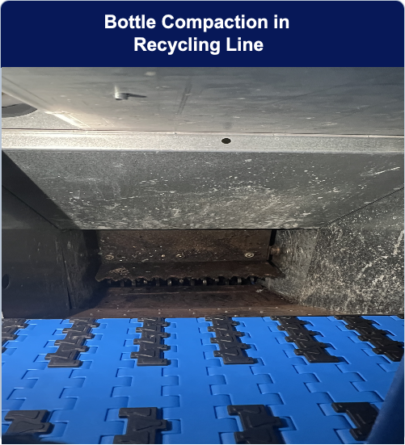
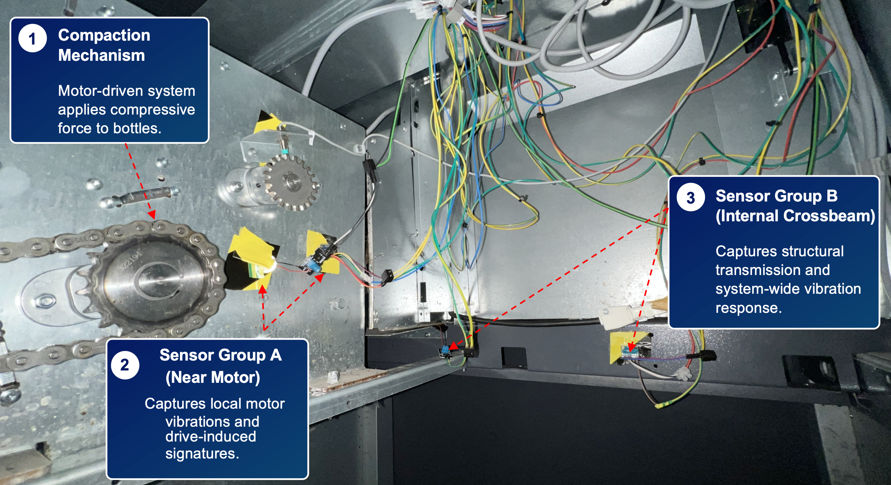

# ConfV2A Dataset and Code

**Confidence-Guided Vibration-to-Acoustic Distillation for Bottle Classification in Recycling Compactors**

ConfV2A trains an audio-only bottle classifier with help from synchronized vibration signals. A vibration teacher is used during training, but deployment only needs microphone audio.


## Highlights

- **Audio-only deployment:** no vibration sensors are required at inference time.
- **Vibration-guided training:** a TCN vibration teacher supervises a CNN acoustic student.
- **Confidence-aware distillation:** uncertain teacher predictions contribute less to the KL distillation term.
- **Real compactor data:** synchronized audio and vibration were collected during bottle/can compression events.
- **Reproducible outputs:** trained models, reports, confusion matrices, alpha sweeps, and noise robustness results are included.

## How To Read This Repository

If you are visiting this project for the first time, follow this order:

1. **Understand the idea:** start with the overview figure above.
2. **Inspect the data collection setup:** see [Dataset Overview](#dataset-overview).
3. **Read the model pipeline:** see [Method](#method).
4. **Follow the code order:** see [Code Navigation](#code-navigation).
5. **Check outputs and comparisons:** see [Results](#results) and [Repository Map](#repository-map).

## Key Result

On the self-collected bottle/can compaction dataset, ConfV2A improves the audio-only baseline from **79.01%** to **90.24%** test accuracy while still using only audio at inference.

| Method | Inference input | Accuracy | Macro-F1 |
| --- | --- | ---: | ---: |
| Audio-only baseline | Audio | 79.01% | 78.19% |
| Vibration teacher | Vibration | 91.14% | 91.80% |
| Standard KD audio student | Audio | 86.99% | 86.62% |
| **ConfV2A audio student** | **Audio** | **90.24%** | **89.83%** |

## Dataset Overview

The self-collected dataset contains synchronized microphone audio and vibration recordings from a bottle-recycling compactor. Audio and vibration windows are temporally aligned so that the vibration teacher can supervise the acoustic student during training.

<p align="center">
  
  
</p>

| Item | Description |
| --- | --- |
| Task | Bottle/can classification in a recycling compactor |
| Modalities | Microphone audio + vibration sensors |
| Classes | 1 L bottle, 500 mL bottle, 330 mL can, 500 mL can, error |
| Events / windows | 120 detected events / 1206 retained windows |
| Window length | 0.8 s aligned audio-vibration windows |
| Split | 70% / 15% / 15% time-wise blocked split |
| Raw data | `data/raw/sensor_plot_project/` |
| Processed vibration data | `data/processed/` |

Main class files:

| Class | Audio file | Raw vibration CSV |
| --- | --- | --- |
| `bottle_1000` | `data/raw/sensor_plot_project/bottle_1/1.wav` | `data/raw/sensor_plot_project/bottle_1/1.csv` |
| `bottle_500` | `data/raw/sensor_plot_project/bottle_500/500ml.wav` | `data/raw/sensor_plot_project/bottle_500/500ml.csv` |
| `bottle_can_330` | `data/raw/sensor_plot_project/bottle_yi_330/yi_330.wav` | `data/raw/sensor_plot_project/bottle_yi_330/yi_330.csv` |
| `bottle_can_500` | `data/raw/sensor_plot_project/bottle_yi_500/yi_500.wav` | `data/raw/sensor_plot_project/bottle_yi_500/yi_500.csv` |
| `error` | `data/raw/sensor_plot_project/error/error.wav` | `data/raw/sensor_plot_project/error/error.csv` |

The `error` class contains abnormal insertion or machine behavior, such as jamming, hesitation, or unusual mechanical noise. Extra files such as `bottle_yi_20/` and `bottle_empty/` are retained for checks but are not part of the main training and evaluation setup.

## Method

ConfV2A uses vibration as a privileged training-time modality:

1. Train an audio-only spectrogram CNN baseline.
2. Train a vibration-only TCN teacher on aligned vibration windows.
3. Distill the vibration teacher into the acoustic student with ground-truth labels and teacher soft labels.
4. Weight the KL term by teacher confidence so unreliable teacher predictions have less influence.
5. Deploy only the trained audio student.

The main loss is:

```text
L = (1 - alpha) * CE + alpha * c_i * KL
```

where `CE` is the ground-truth cross-entropy loss, `KL` transfers teacher soft-label information, `c_i` is the teacher confidence, `temperature=3.0`, and `alpha=0.4` in the main experiment.

## Code Navigation

The source code is organized under `src/`. For reading or reproducing the pipeline, follow this order:

> [!IMPORTANT]
> The subfolders under `src/` are used to present the repository clearly on GitHub. The current scripts retain their original local imports and are not intended to run directly from this categorized layout.
>
> To run the code, place the Python source files from `src/models/`, `src/utils/`, `src/training/`, `src/experiments/`, and `src/evaluation/` together in one working directory. Keep the TCN file under `layers/tcn.py` inside that directory. In other words, use a flat source layout for execution rather than the categorized layout shown on the repository page.

| Step | File | Purpose |
| --- | --- | --- |
| 1 | `src/preprocessing/Step1-Log.ipynb` | Converts raw sensor logs into processed vibration CSV files under `data/processed/`. |
| 2 | `src/training/train_time_aligned_audio_spectrogram.py` | Trains the audio-only spectrogram CNN baseline. |
| 3 | `src/training/train_time_aligned_tcn_teacher.py` | Trains the vibration-only TCN teacher. |
| 4 | `src/training/train_audio_student_distill_paper_kl_ce.py` | Trains the main ConfV2A audio student with confidence-weighted KL + CE. |
| 5 | `src/training/train_audio_student_distill_tcn_teacher.py` | Trains the standard KD baseline without confidence weighting. |
| 6 | `src/experiments/train_audio_student_distill_paper_kl_ce_noise.py` | Runs ConfV2A noise robustness evaluation. |
| 7 | `src/evaluation/eval_no_confidence_student_waveform_noise.py` | Runs standard KD noise robustness evaluation. |
| 8 | `src/experiments/run_paper_kl_ce_alpha_sweep_plain.py` | Runs the alpha sweep experiment. |
| 9 | `src/evaluation/test.py` | Runs single-file audio inference with a trained student model. |

Example command order after preparing the flat working directory:

```bash
python train_time_aligned_audio_spectrogram.py
python train_time_aligned_tcn_teacher.py
python train_audio_student_distill_paper_kl_ce.py
```

## Results

### Noise Robustness

Under waveform-level Gaussian noise, ConfV2A consistently outperforms standard knowledge distillation.

| Model | Clean | 30 dB | 20 dB | 10 dB | 5 dB | 0 dB |
| --- | ---: | ---: | ---: | ---: | ---: | ---: |
| Standard KD | 86.99% | 87.80% | 88.62% | 83.74% | 74.80% | 55.28% |
| **ConfV2A** | **90.24%** | **91.87%** | **90.24%** | **86.18%** | **78.86%** | **56.10%** |

## Repository Map

| Path | Purpose |
| --- | --- |
| `data/raw/` | Raw audio and vibration recordings |
| `data/processed/` | Processed vibration CSV files generated from sensor logs |
| `src/models/` | Audio student and TCN model components |
| `src/preprocessing/` | Sensor-log preprocessing notebook |
| `src/training/` | Baseline, teacher, and student training scripts |
| `src/experiments/` | Noise robustness and alpha-sweep experiments |
| `src/evaluation/` | Evaluation and single-file inference scripts |
| `src/utils/` | Shared event-window and synchronization utilities |
| `results/main/` | Main paper models and reports |
| `results/baselines/` | Standard knowledge-distillation baselines |
| `results/ablations/` | Alpha-sweep and ablation outputs |
| `results/robustness/` | Waveform-noise robustness evaluations |
| `results/supplementary/` | Newly trained and supplementary runs |
| `results/inference/` | Single-file inference outputs |
| `figures/` | Images used by this README and the project page |
| `index.html` | Optional lightweight GitHub Pages project page |

<details>
<summary>Detailed folder contents</summary>

| Path | Purpose |
| --- | --- |
| `data/raw/sensor_plot_project/` | Raw synchronized audio and vibration recordings |
| `data/processed/` | Processed vibration CSV files |
| `src/preprocessing/Step1-Log.ipynb` | Sensor-log preprocessing notebook |
| `src/models/audio_student_model.py` | Audio loading, windowing, spectrogram, and CNN utilities |
| `src/utils/event_windows.py` | Time-aligned audio-vibration window utilities |
| `src/models/layers/tcn.py` | TCN layer used by the vibration teacher |
| `results/main/original_time_aligned_audio_spectrogram_outputs/` | Original audio-only CNN model and reports used for main results |
| `results/main/original_time_aligned_tcn_teacher_outputs/` | Original vibration teacher model and reports used for main results |
| `results/supplementary/time_aligned_audio_spectrogram_outputs/` | Newly trained audio-only model outputs |
| `results/supplementary/time_aligned_tcn_teacher_outputs/` | Newly trained vibration teacher outputs |
| `results/main/distill_outputs_paper_kl_ce_old/` | Main ConfV2A results with original models |
| `results/baselines/distill_outputs_paper_kl_ce_no_confidence_old/` | Standard KD results with original models |
| `results/ablations/distill_outputs_paper_kl_ce_alpha_sweep_plain_old/` | Alpha sweep with original models |
| `results/robustness/distill_outputs_paper_kl_ce_waveform_noise_snr_test_old/` | ConfV2A waveform-level noise evaluation |
| `results/robustness/distill_outputs_paper_kl_ce_no_confidence_waveform_noise_snr_test_old/` | Standard KD waveform-level noise evaluation |
| `results/supplementary/distill_outputs_paper_kl_ce_alpha_sweep_new/` | Supplementary alpha sweep with newly trained models |

</details>

## Experimental Note

The main reported evaluations were performed with:

```text
results/main/original_time_aligned_audio_spectrogram_outputs/
results/main/original_time_aligned_tcn_teacher_outputs/
```

For the main paper-aligned results, prioritize folders ending in `_old`. The `time_aligned_*` and `*_new` folders are supplementary runs using newly trained models after a system update.

